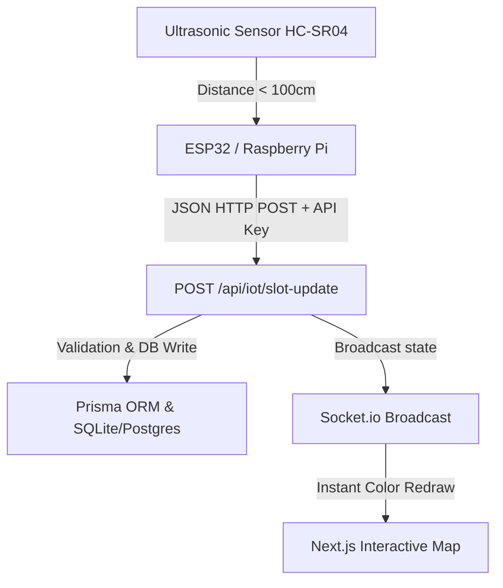

# 🚗 ParkSense: Real-Time Smart Campus Parking Slot Tracker

**ParkSense** is a complete, production-grade web application built to solve daily parking congestion on engineering college campuses (optimized for AKTU-affiliated institutions in India). It features an interactive **Custom SVG live-updating campus map**, an automated **15-minute slot reservation system**, a dedicated **gate security guard console**, and executive **Recharts utilization analytics**.

---

## 🏗️ Monorepo Architecture Overview

This project is organized as a clean TypeScript-orchestrated monorepo:
* **`/server`**: Node.js + Express backend running SQLite (Prisma ORM), node-cron auto-releases, a live demo simulator, and Socket.io broadcasts.
* **`/client`**: Next.js 14 App Router + Tailwind CSS, Framer Motion, Zustand state sync, React Query (TanStack Query), and Recharts charts.
* **`/client/public/manifest.json`**: PWA registration so students can install the tracker directly on their phone home screens.

---

## ⚡ Quick Start (Local Setup)

To run the application locally on your Windows environment, follow these steps:

### 1. Install Dependencies
Run from the root directory to install packages in both the `/client` and `/server` subfolders:
```bash
npm run install:all
```

### 2. Pushes Database Schema & Seed Data
Initialize the lightweight local SQLite database (`dev.db`) and seed it with 90 slots, 5 default users, active reservations, and 50 historical logs:
```bash
# Move into server
cd server

# Synchronize tables
npx prisma db push

# Populate with mock AKTU-campus data
npm run prisma:seed

# Return to root
cd ..
```

### 3. Run Both Servers Concurrently
Open two separate terminal windows (or run from root using the concurrent commands):
* **Terminal 1 (Backend)**: `npm run dev:server` (Starts Express and Socket.io on port `5000`)
* **Terminal 2 (Frontend)**: `npm run dev:client` (Starts Next.js App Router on port `3000`)

Open [http://localhost:3000](http://localhost:3000) in your browser.

---

## 👥 Pre-Configured Demo Accounts

Use these accounts to test the various dashboards:
* **College Director (Admin)**: `admin@parksense.in` (Password: `admin123`)
* **HOD CSE (Faculty)**: `faculty@parksense.in` (Password: `faculty123`)
* **Gate Security (Guard)**: `guard@parksense.in` (Password: `guard123`)
* **Vaibhav Yadav (Student)**: `student1@parksense.in` (Password: `student123`)

*(Hint: Use the "⚡ Quick Demo Logins" buttons on the `/login` screen to bypass typing!)*

---

## 📡 IoT-Ready Hardware Sensor Architecture

While this MVP runs on a background **Live Traffic Simulation Engine** (generating realistic entries and exits every 30s), the architecture is 100% ready to bind real hardware sensors for production deployment:



### 1. Hardware Integration Guide
To deploy physical hardware in each campus parking slot:
* **Sensors**: Install an **HC-SR04 ultrasonic sensor** (or geomagnetism induction loop) mounted directly over/under each parking slot.
* **Microcontrollers**: Connect sensors in groups to an **ESP32 NodeMCU** or **Raspberry Pi Pico W**.
* **Detection Logic**: Program the microcontroller to measure distance. If the distance drops below 120cm (indicating a parked car), mark the slot as `occupied`. If it reads above 120cm, mark it as `free`.

### 2. Dedicated IoT API Endpoint (Proposed)
Add the following endpoint to `server/src/routes/api.ts` to receive sensor updates directly:

```typescript
// POST /api/iot/slot-update
router.post('/iot/slot-update', async (req, res) => {
  const { slotId, occupied, apiKey } = req.body;

  // Simple IoT Device API Key authorization
  if (apiKey !== process.env.IOT_API_KEY) {
    return res.status(401).json({ error: "Invalid IoT registration key." });
  }

  const targetStatus = occupied ? 'OCCUPIED' : 'AVAILABLE';

  try {
    await prisma.slot.update({
      where: { id: slotId },
      data: { status: targetStatus }
    });

    // Invalidate Redis caches and broadcast to WebSockets
    await invalidateCache('parksense:slots');
    await emitSlotUpdate(slotId, targetStatus);

    return res.status(200).json({ success: true, slotId, status: targetStatus });
  } catch (err) {
    return res.status(500).json({ error: "IoT database sync failure." });
  }
});
```

### 3. MQTT Broker Alternative for Large Deployments
For deployments spanning more than 200 parking spots, HTTP polling or raw POST requests create unnecessary network overhead:
* **Broker**: Deploy an **Eclipse Mosquitto** MQTT Broker on a campus server.
* **Publishing**: Microcontrollers publish small payloads (`parksense/slots/A-01 -> {"occupied": true}`) on occupancy state changes.
* **Subscribing**: The Express backend runs an MQTT client subscription worker. When a message is received, it pushes it through the same Prisma DB + Socket.io pipeline. This reduces latency to **sub-50ms** and lowers microcontroller battery usage.
